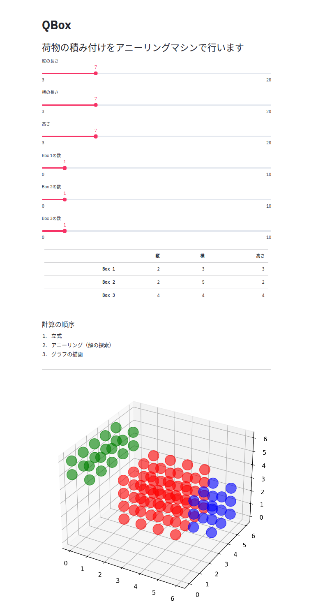

# QBox


## 概要
　「与えられた荷物をいかに効率的に詰め込みできるか」という**3次元パッキング問題**を解き、`streamlit`を用いて
アプリケーションにしました。

　[QA4U](https://altema.is.tohoku.ac.jp/QA4U/)
のチーム15, 萩の月が作成しました。

　問題設定の背景や、技術的な解説はスライドに掲載しています。
https://docs.google.com/presentation/d/1VoLTOqpcyjcZ5-Gy76QV-TtskB_2y4sY3eZCUOL4ZZI/edit?usp=sharing

## 使い方
　本アプリではAmplify AEを用いています。
使用するには[AmplifyのHP](https://amplify.fixstars.com/ja/) からアクセストークンを入手し、トークンを適切な場所に貼り付けてください。

```python
import json
with open("/home/yuma/.amplify/token.json") as f:
    client.token = json.load(f)["AMPLIFY_TOKEN"]
```

トークンだけ書き換えてください。

```python
client.token = "********"  # ←ここにAmplifyのtokenを貼り付ける
```

 　`requirements.txt`に書かれてあるライブラリがインストールされている環境で以下のコマンドを実行してください。
```bash
streamlit app.py
```

## スクリーンショット
